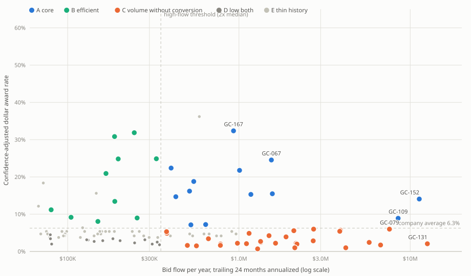
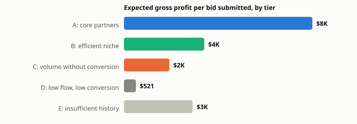

# Grading the customer list: ranking GCs under small samples

A glazing subcontractor bids work to general contractors and wins a fraction of it. When estimating capacity runs short, the bid queue needs an order, and the order should reflect which GCs actually produce profit. This repo grades every GC in the bidding ledger of the ERP system documented in my [construction-erp-case-study](https://github.com/brandongourley/construction-erp-case-study), and it deals with the statistical problem that makes naive customer leaderboards wrong: most customers have only a handful of observations.

The companion repo, [bid-win-probability-backtest](https://github.com/brandongourley/bid-win-probability-backtest), audits the same ledger as a forecasting problem and counts a job scope once no matter how many GCs it was priced to. This analysis grades the GCs themselves, so the unit here is one job scope priced to one GC, restricted to the commercial and storefront divisions.

**Data vintage and anonymization.** This is a frozen snapshot. Award rates and records are all-time figures within the window unless noted. Flow figures use the trailing 24 months, annualized. The live numbers move as new bids are logged. GC identities are replaced with codes assigned in random order (verified: Spearman correlation of code number against bid volume is 0.014 and against priority rank is 0.023), dollar amounts are uniformly rescaled by an undisclosed constant and rounded to at most three significant figures, margins are uniformly rescaled, and all time references are relative. The identity map and scaling constants stay private, so the transformation pipeline is not in this repo; everything downstream of the anonymized dataset reproduces from this repo alone.

## The data

| | |
|---|---|
| Opportunities (one job scope priced to one GC) | **2,169** |
| Decided (won or lost) | 1,945: **209 won** |
| General contractors | **186** |
| Window | ~3.6 years, ending at the snapshot date |
| Divisions | commercial and storefront |
| Total bid / total awarded (rescaled) | $402M / $25M |
| Company dollar award rate | **6.3%** |

## The problem with the obvious leaderboard

Rank customers by raw award rate and the top of the list fills with customers who have almost no history. A customer with one bid and one win posts a 100% rate. That number describes luck, not a relationship. The fix used here is standard empirical Bayes shrinkage: each GC's rate is blended toward the company average, weighted by how much history the GC has. A GC with two bids sits near the company average. A GC with 150 bids keeps its own number. The two tables below rank the same dataset both ways.

**Naive: raw dollar award rate**

| | GC | $ rate | Bids | Awarded |
|---|---|---|---|---|
| 1 | GC-156 | 100.0% | 2 | $53K |
| 2 | GC-041 | 100.0% | 2 | $29K |
| 3 | GC-033 | 100.0% | 1 | $12K |
| 4 | GC-115 | 100.0% | 1 | $7K |
| 5 | GC-148 | 100.0% | 1 | $122 |
| 6 | GC-089 | 96.2% | 3 | $1.1M |
| 7 | GC-142 | 92.0% | 2 | $36K |
| 8 | GC-024 | 63.0% | 2 | $11K |
| 9 | GC-072 | 62.7% | 5 | $307K |
| 10 | GC-055 | 60.4% | 5 | $227K |

7 of the ten leaders have one or two lifetime bids. The largest sample in the table is 5 bids.

**Adjusted: expected gross profit per year**

| | GC | Exp GP/yr | Adj rate | Record |
|---|---|---|---|---|
| 1 | GC-152 | $453K | 14.1% | 24/158 |
| 2 | GC-109 | $217K | 8.9% | 23/169 |
| 3 | GC-067 | $117K | 24.5% | 4/9 |
| 4 | GC-079 | $103K | 6.0% | 8/109 |
| 5 | GC-131 | $101K | 2.1% | 12/133 |
| 6 | GC-167 | $90K | 32.4% | 4/8 |
| 7 | GC-166 | $70K | 15.5% | 2/7 |
| 8 | GC-181 | $69K | 5.7% | 4/70 |
| 9 | GC-003 | $63K | 6.0% | 3/30 |
| 10 | GC-089 | $61K | 36.2% | 2/3 |

Volume, conversion, and margin combine into one dollar figure per GC. The smallest sample in this table is 3 bids.

## Method

- **Opportunity**: one job plus scope plus GC. Multiple bid options on the same scope collapse to one row, the awarded option if won, otherwise the largest.
- **Award rate**: awarded dollars divided by bid dollars. Open bids stay in the denominator. They were sent and have not been awarded.
- **Confidence adjustment**: empirical Bayes shrinkage. Each GC's dollar rate is blended toward the company average with a prior weight of k bids, where k was fit from the data by method of moments (k = 6). The weight is w = n / (n + k).
- **Flow per year**: bid dollars in the trailing 24 months, divided by two. Sales cycles here run long, and a 12-month window is noisy.
- **Margin**: dollar-weighted gross profit percent on each GC's awarded work, falling back to their bid margin where no awards exist.
- **Expected GP per year**: flow times adjusted rate times margin. The ranking number is in dollars, and the weights are arithmetic rather than chosen.

### Sensitivity to the shrinkage weight

The fitted value is k = 6. Two things could depend on it: tier membership and rank order. Tier membership turns out to be structurally invariant to k. The tier rule compares each GC's adjusted rate to the company average, and shrinking a rate toward that same average can never move it across the average. A GC above the line stays above it at any k, so tier assignments are identical at k = 3, 6, and 10 by construction. Rank order can move, because k changes the magnitude of each adjusted rate. In practice it barely does: top-ten membership changes by 2 GCs (GC-089, GC-123), top-twenty membership changes by 2 (GC-072, GC-049), and the table below lists every GC in the top twenty whose position moves by two or more places across the three values.

| GC | Rank at k=3 | k=6 | k=10 |
|---|---|---|---|
| GC-067 | 3 | 3 | 5 |
| GC-131 | 6 | 5 | 3 |
| GC-167 | 4 | 6 | 6 |
| GC-166 | 8 | 7 | 9 |
| GC-181 | 9 | 8 | 7 |
| GC-003 | 10 | 9 | 8 |
| GC-089 | 7 | 10 | 12 |
| GC-123 | 12 | 11 | 10 |
| GC-038 | 15 | 12 | 11 |
| GC-130 | 11 | 13 | 14 |
| GC-160 | 13 | 14 | 15 |
| GC-182 | 16 | 15 | 13 |
| GC-014 | 14 | 16 | 18 |
| GC-015 | 18 | 17 | 16 |
| GC-049 | 22 | 20 | 20 |
| GC-072 | 20 | 21 | 26 |

## The map

One dot per GC. Horizontal position is annual bid flow. Vertical position is the confidence-adjusted dollar award rate. The dashed lines are the tier thresholds.



## Tiers and the priority list

Tiers come from two axes: flow at least twice the median, and adjusted rate at least the company average. GCs with fewer than five lifetime opportunities are held out as ungraded, and GCs with no bids in 24 months are dormant. The last column is the justification for the whole exercise: expected gross profit per bid submitted, by tier.

| Tier | GCs | Flow/yr | Exp GP/yr | Exp GP per bid |
|---|---|---|---|---|
| A: core partners | 13 | $29M | $1.2M | $8K |
| B: efficient niche | 10 | $1.9M | $105K | $4K |
| C: volume without conversion | 30 | $77M | $738K | $2K |
| D: low flow, low conversion | 17 | $2.8M | $23K | $521 |
| E: insufficient history | 110 | $13M | $230K | $3K |
| F: dormant | 6 | $0 | $0 | n/a |



The C tier is the finding that matters operationally. Those 30 GCs absorb $77M per year of bidding, about 2.6 times the A tier's $29M, and return less total expected profit. A bid submitted to an A-tier GC carries roughly $8K in expected gross profit against roughly $2K for a C-tier bid. One caveat belongs next to that conclusion: this analysis identifies where estimating hours produce the least expected profit, not why conversion is low. A low conversion rate on high bid volume at healthy margins can indicate uncompetitive pricing rather than a weak relationship, and those two diagnoses call for opposite responses.

Top twenty by expected annual gross profit:

| | GC | Tier | Exp GP/yr | Flow/yr | Adj rate | 24-mo record | GP% | All-time | Last bid |
|---|---|---|---|---|---|---|---|---|---|
| 1 | GC-152 | A | $453K | $11M up | 14.1% | 14/115 at 8.9% | 28% | 24/158 | <1 mo |
| 2 | GC-109 | A | $217K | $8.5M flat | 8.9% | 15/82 at 6.3% | 29% | 23/169 | <1 mo |
| 3 | GC-067 | A | $117K | $1.5M up | 24.5% | 4/9 at 36.8% | 31% | 4/9 | 3 mo |
| 4 | GC-079 | C | $103K | $7.6M down | 6.0% | 7/65 at 10.7% | 23% | 8/109 | <1 mo |
| 5 | GC-131 | C | $101K | $13M up | 2.1% | 5/92 at 1.9% | 39% | 12/133 | <1 mo |
| 6 | GC-167 | A | $90K | $930K flat | 32.4% | 4/8 at 52.0% | 30% | 4/8 | 4 mo |
| 7 | GC-166 | A | $70K | $1.6M up | 15.5% | 2/7 at 23.4% | 29% | 2/7 | 2 mo |
| 8 | GC-181 | C | $69K | $3.9M flat | 5.7% | 3/29 at 13.7% | 31% | 4/70 | <1 mo |
| 9 | GC-003 | C | $63K | $2.7M down | 6.0% | 0/15 at 0.0% | 39% | 3/30 | <1 mo |
| 10 | GC-089 | E | $61K | $587K  | 36.2% | 2/3 at 96.2% | 29% | 2/3 | 10 mo |
| 11 | GC-123 | C | $59K | $3.9M flat | 5.4% | 3/52 at 0.3% | 28% | 6/87 | <1 mo |
| 12 | GC-038 | C | $50K | $6.7M down | 1.7% | 4/45 at 2.3% | 43% | 4/71 | <1 mo |
| 13 | GC-130 | A | $50K | $1.0M up | 21.8% | 2/7 at 35.1% | 23% | 2/7 | 1 mo |
| 14 | GC-160 | A | $46K | $1.2M down | 15.3% | 3/13 at 27.0% | 26% | 3/16 | <1 mo |
| 15 | GC-182 | C | $42K | $5.8M down | 2.4% | 5/64 at 3.6% | 30% | 5/85 | <1 mo |
| 16 | GC-014 | A | $37K | $402K down | 22.4% | 0/2 at 0.0% | 42% | 1/6 | 17 mo |
| 17 | GC-015 | C | $35K | $2.7M flat | 2.8% | 2/18 at 2.4% | 46% | 2/21 | 2 mo |
| 18 | GC-133 | C | $35K | $2.1M up | 5.6% | 0/25 at 0.0% | 30% | 7/48 | <1 mo |
| 19 | GC-112 | A | $27K | $545K down | 18.8% | 1/6 at 51.9% | 27% | 2/19 | 15 mo |
| 20 | GC-049 | C | $23K | $1.9M up | 3.9% | 0/14 at 0.0% | 31% | 2/27 | <1 mo |

## When the two rates disagree

Each GC has two award rates: a dollar rate and a count rate. They can disagree, and the direction of the disagreement describes which of the GC's jobs we win. A dollar rate above the count rate means the GC awards us its larger jobs. A count rate above the dollar rate means we win the GC's small work and lose its large work, which points at either pricing at size or the shape of the relationship.

**Dollar rate above count rate**

| GC | $ rate | # rate | Avg won | Avg lost | Record |
|---|---|---|---|---|---|
| GC-014 | 38.6% | 16.7% | $854K | $272K | 1/6 |
| GC-062 | 31.9% | 18.8% | $92K | $40K | 3/16 |
| GC-154 | 27.7% | 15.4% | $201K | $95K | 2/13 |
| GC-112 | 22.7% | 10.5% | $457K | $183K | 2/19 |

**Count rate above dollar rate**

| GC | $ rate | # rate | Avg won | Avg lost | Record |
|---|---|---|---|---|---|
| GC-116 | 1.2% | 33.3% | $686 | $28K | 2/6 |
| GC-117 | 4.3% | 31.3% | $22K | $237K | 5/16 |
| GC-021 | 9.9% | 33.3% | $34K | $155K | 2/6 |
| GC-072 | 62.7% | 80.0% | $77K | $183K | 4/5 |
| GC-177 | 19.3% | 36.4% | $58K | $156K | 4/11 |
| GC-002 | 3.3% | 16.7% | $12K | $73K | 2/12 |
| GC-052 | 10.2% | 23.1% | $55K | $160K | 3/13 |
| GC-150 | 0.9% | 11.1% | $4K | $53K | 1/9 |
| GC-098 | 14.9% | 25.0% | $31K | $58K | 2/8 |
| GC-074 | 4.9% | 14.3% | $28K | $92K | 2/14 |

## Recency

The ranking uses the stable lifetime rate. Recency enters as evidence beside it rather than blended into it. Flow counts only the trailing 24 months, so a GC that stops sending work declines in the ranking on its own. The priority table shows a flow trend word comparing the last 12 months to the 12 before, and a trailing-24-month record beside the all-time record. A GC whose good lifetime rate has no recent wins behind it is visible in one glance, and so is a GC whose weak lifetime rate hides an improving recent run. Both patterns exist in this dataset.

## Limitations

- Outcomes are logged by people. Some losses resolve late or never, and the open share of the denominator reflects follow-up diligence as well as GC behavior.
- Margin fields are missing or hand-entered on a minority of rows, mostly bids logged outside the estimating tools.
- The expected-GP figure assumes the next two years of flow resemble the last two. The trend column exists because that assumption fails for individual GCs.
- Shrinkage corrects for sample size, not for selection. Which jobs a GC chooses to invite us to is not random.
- This is a frozen snapshot. Every figure moves as new bids are logged, and the published numbers are uniformly rescaled.

## Reproduce

```
node src/tiers.mjs        # tier table, per-bid economics, top 15, from data/gc_metrics.csv
node src/tiers.mjs 3      # same at k=3 (also try 10) to see the sensitivity yourself
```

No dependencies; Node >= 18. `data/gc_metrics.csv` is the anonymized per-GC dataset (186 rows; data dictionary in the header comment of `src/tiers.mjs`). Its dollar columns are rounded to three significant figures, so recomputed figures match this README to within that rounding. The identity map and scaling constants are private by design, which is why the raw bid rows and the transformation pipeline are not here.

---

*Part of a set on a production construction ERP: [the system itself](https://github.com/brandongourley/construction-erp-case-study), [a walk-forward backtest of its win-probability model](https://github.com/brandongourley/bid-win-probability-backtest), and [the overhead-per-bid economics of the same pipeline](https://github.com/brandongourley/overhead-per-bid-analysis).*
